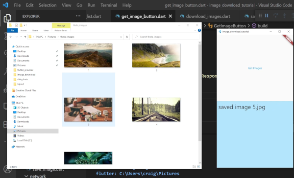
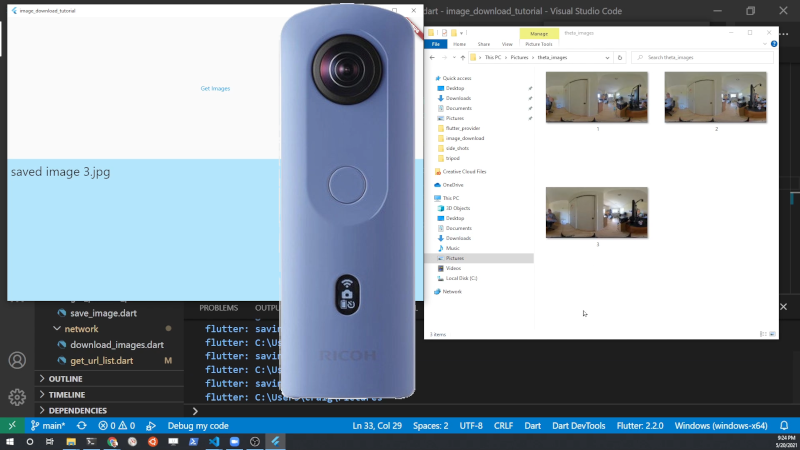
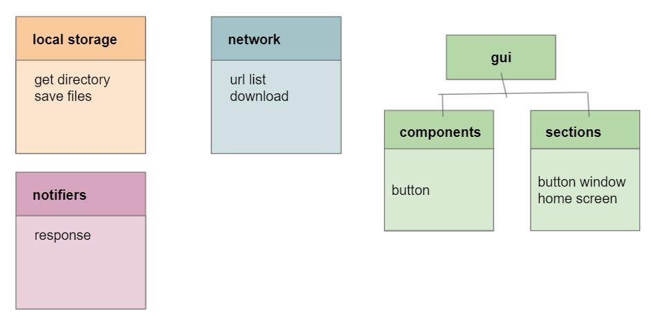

# Download Images from Network to Windows Pictures Directory with Flutter 2.2

Code for the tutorial on downloading images from the network and saving images
to the pictures directory of Windows 10.  You do not need the RICOH THETA to
complete the tuturial.  I first show how to download the images from a free
network site before connecting to the RICOH THETA.  The code to download the images
from the RICOH THETA or other network source is isolated into a separate class method.
It is easy to switch between code for the Lorem Picsum free image site and
the RICOH THETA.

The SC2 images are downloaded from the RICOH THETA SC2 using 2.4 GHz Wi-Fi. To
connect to the SC2, the Windows 10 computer connects to the SC2 as if it were a
hotspot.  The Windows computer should have two network connections.  The SC2
is always at 192.168.1.1.  If your router is at the same IP address, you must
disconnect from the Internet or change the IP address of your router. The
IP address of the SC2 cannot be changed.

## Videos

* [Flutter 2 Tutorial for Windows Desktop - Download and Save to Pictures Folder: Introduction ](https://youtu.be/8ZO3waTBCW0) - 4:44

## Learning Objectives

### Overall

* save images from network to local files with built-in Dart File
* create directory for file if path does not exist
* get images from network as bytes with `http`
* find local directory structure with `path_provider`

### RICOH THETA Specific

* list files on camera
* parse file information to get URI for each image file

## App Architecture

